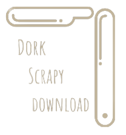

<p align="center"></p>

<h1 align="center">Dork Scrapy Download</h1> 

DSD possibilita a raspagem de links por meio de dorks e os armazena em um arquivo `csv`. Posterior a essa etapa concluida o download dos arquivos será realizado.


### Configuração
- Passo 1 - Para utiliza-lo é necessário ter um chave de api [Serapi](https://serpapi.com/). O plano free lhe permite 100 pesquisas.
- Passo 2 - Insira a chave de api no arquivo `<main.py>`em `<key = 'chave aqui'>`.


### Requerimentos:
- Realize a instalação dos pacotes para utilizar o DSD através do seguinte comando:

```
pip3 install -r requirements.txt
```
ou
```
pip install -r requirements.txt
```
## Rodando

Para rodar execute o arquivo `<main.py>`
```
python3 main.py
```
ou
```
python main.py
```

- Informe a dork no campo `url`.
- Informe o nome do diretório ou diretório e subdiretório
    ```
    Ex.: 
  diretorio
  diretorio/subdir
  dir3/sub1/arquivos
  
  * sempre utilizando a barra *
    ```
- Sempre que inserir o nome do arquivo acrescente `.csv` ao final.
- informe o número da paginação. Lembre-se de visualizar no navegador antes, estando alterado o retorno de 
pesquisa de `10` para `100`. 


## Feito Com:
[](https://www.microsoft.com/pt-br/windows/get-windows-10)
[](https://code.visualstudio.com/)


### Social

[](https://www.linkedin.com/in/0moura/)

<p align="center">Copyright © 2022 0moura</p>